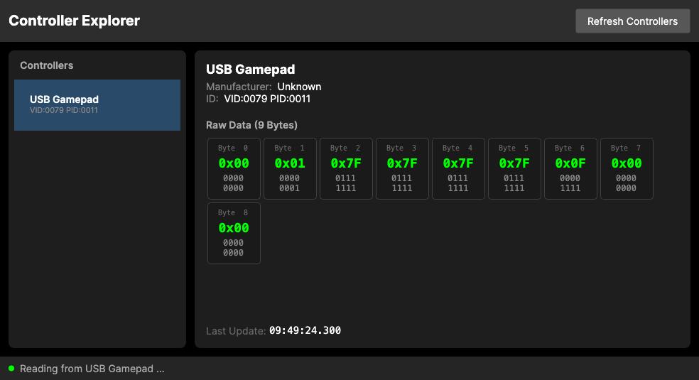
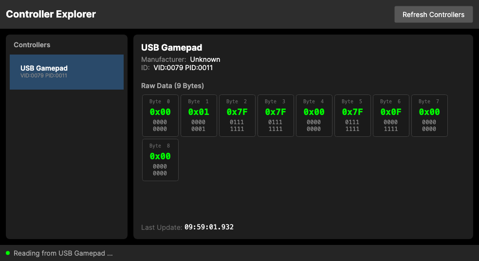
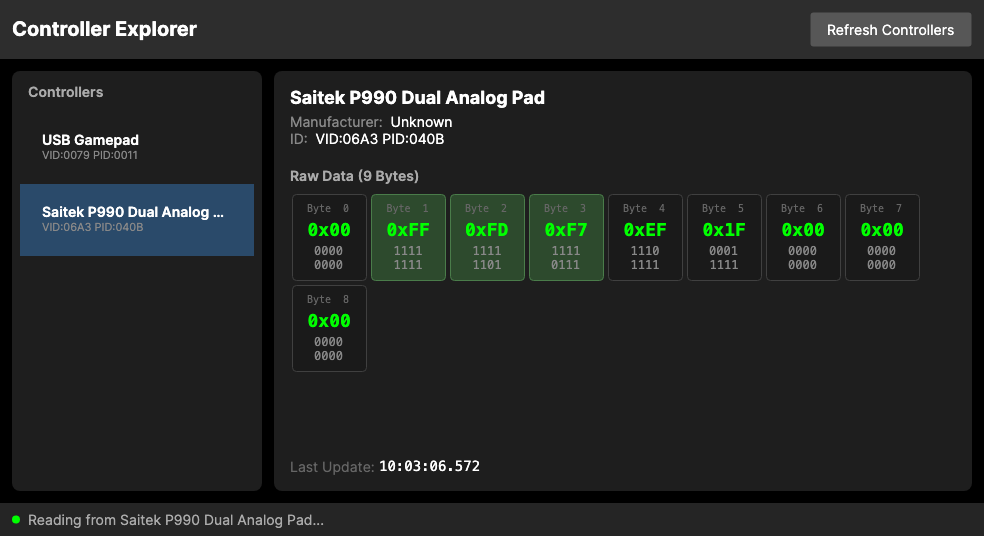

# Controller Explorer

A cross-platform .NET 9 application built with Avalonia UI for reading and displaying real-time data from USB and Bluetooth game controllers. This tool assists in creating games that read from these controllers by providing visibility into the raw input data.

## Features

- **Multi-controller support** - Detects and lists all connected USB/Bluetooth game controllers
- **XInput support (Windows)** - Native support for Xbox-compatible controllers including ROG Ally, Xbox controllers, and other XInput devices
- **Real-time data display** - Shows controller data updating continuously with variable byte counts based on device type
- **Hex + Binary visualization** - Each byte displayed as hex (e.g., `0x3F`) with full 8-bit binary breakdown
- **Change highlighting** - Visual indicator when byte values change
- **Cross-platform** - Runs on Windows, macOS, and Linux
- **Screenshot export** - Save the current view as a PNG image

## Keyboard Shortcuts

| Shortcut | Action |
|----------|--------|
| `Ctrl+S` | Save screenshot as PNG |

## Screenshots








The application displays:
- Left panel: List of detected controllers with VID:PID identifiers (HID) or XInput index (Xbox controllers)
- Right panel: Controller metadata and data grid with hex/binary values
- Status bar: Connection status and last update timestamp

## Byte Data Documentation

### XInput Controllers (Windows)

Xbox-compatible controllers on Windows use XInput and report 12 bytes of data:

| Bytes | Description | Values |
|-------|-------------|--------|
| 0-1 | Buttons | 16-bit flags (see button table below) |
| 2 | Left Trigger | 0-255 |
| 3 | Right Trigger | 0-255 |
| 4-5 | Left Stick X | -32768 to 32767 (little-endian) |
| 6-7 | Left Stick Y | -32768 to 32767 (little-endian) |
| 8-9 | Right Stick X | -32768 to 32767 (little-endian) |
| 10-11 | Right Stick Y | -32768 to 32767 (little-endian) |

#### XInput Button Flags (Bytes 0-1)

| Bit | Button |
|-----|--------|
| 0 | D-Pad Up |
| 1 | D-Pad Down |
| 2 | D-Pad Left |
| 3 | D-Pad Right |
| 4 | Start |
| 5 | Back |
| 6 | Left Stick Press |
| 7 | Right Stick Press |
| 8 | Left Bumper |
| 9 | Right Bumper |
| 12 | A |
| 13 | B |
| 14 | X |
| 15 | Y |

### HID Controllers (All Platforms)

HID controllers report variable-length data depending on the device. The byte layout is device-specific and varies by manufacturer. Common patterns include:

- **Byte 0**: Often a report ID
- **Buttons**: Usually packed as bit flags across 1-3 bytes
- **Analog sticks**: Typically 1 byte per axis (0-255, centered at 128)
- **Triggers**: Usually 1 byte each (0-255)
- **D-Pad**: Often encoded as a 4-bit value (0-7 for directions, 8 or 15 for neutral)

Use the binary visualization to observe which bits change when pressing buttons, and watch the hex values when moving analog inputs to decode your specific controller's data format.

## Requirements

- [.NET 9 SDK](https://dotnet.microsoft.com/download/dotnet/9.0)
- A USB or Bluetooth game controller

## Building

```bash
# Clone the repository
git clone https://github.com/yourusername/ControllerExplorer.git
cd ControllerExplorer

# Build
dotnet build

# Run
dotnet run
```

## Usage

1. Connect a USB or Bluetooth game controller to your computer
2. Launch the application
3. Click **Refresh Controllers** to scan for connected devices
4. Select a controller from the list
5. Interact with the controller (press buttons, move sticks, triggers)
6. Observe the byte values updating in real-time

## Platform Notes

### Windows

**XInput Controllers**: Xbox-compatible controllers (Xbox 360, Xbox One, Xbox Series, ROG Ally, etc.) are automatically detected via XInput and appear with "XInput" in their identifier. These controllers are polled at ~60Hz.

**HID Controllers**: Non-Xbox controllers (PlayStation, Nintendo, third-party) are read via HID and appear with their VID:PID.

### macOS

You may need to grant accessibility permissions for the application to read HID devices. Go to **System Preferences > Security & Privacy > Privacy > Input Monitoring** and add the application.

Note: Xbox controllers on macOS are read via HID (not XInput) and will have a different byte layout than on Windows.

### Linux

You may need to configure udev rules to allow non-root access to HID devices:

```bash
# Create a udev rule (example)
sudo nano /etc/udev/rules.d/99-hid.rules

# Add a rule for your controller (replace VID and PID)
SUBSYSTEM=="hidraw", ATTRS{idVendor}=="xxxx", ATTRS{idProduct}=="yyyy", MODE="0666"

# Reload rules
sudo udevadm control --reload-rules
```

## Technology Stack

- **.NET 9** - Target framework
- **Avalonia UI 11.x** - Cross-platform UI framework
- **HidSharp** - Cross-platform HID device library
- **Vortice.XInput** - XInput wrapper for Windows
- **CommunityToolkit.Mvvm** - MVVM framework

## Project Structure

```
ControllerExplorer/
├── Models/
│   ├── ControllerDevice.cs    # Device wrapper (HID + XInput)
│   └── ControllerData.cs      # Variable-length data container
├── Services/
│   ├── IControllerService.cs  # Service interface
│   ├── HidControllerService.cs # HID reading implementation
│   ├── XInputControllerService.cs # XInput reading (Windows)
│   └── CompositeControllerService.cs # Combines HID + XInput
├── ViewModels/
│   ├── ByteDisplayViewModel.cs # Individual byte display
│   ├── ControllerViewModel.cs  # Controller with bytes
│   └── MainWindowViewModel.cs  # Main orchestration
├── Views/
│   └── MainWindow.axaml       # Main UI
└── Converters/
    └── BoolToColorConverter.cs # Status indicator
```

## License

This project is licensed under the MIT License - see the [LICENSE](LICENSE) file for details.

## Author

Lonnie Watson
