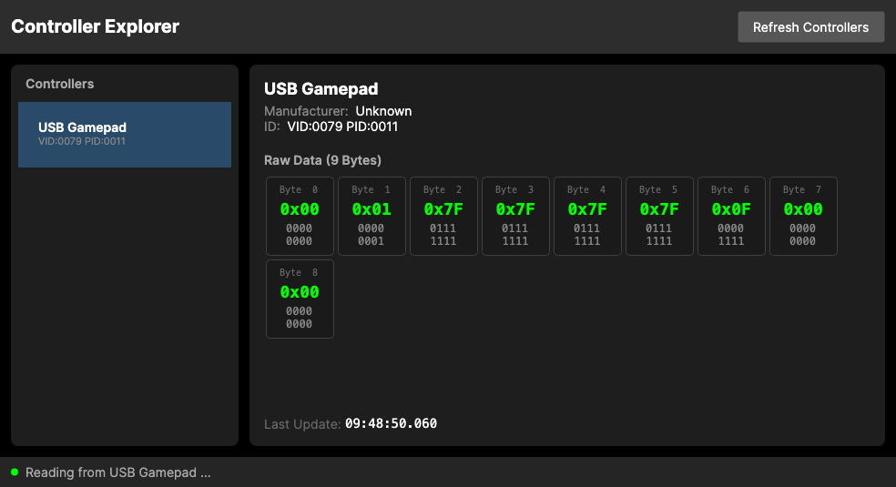
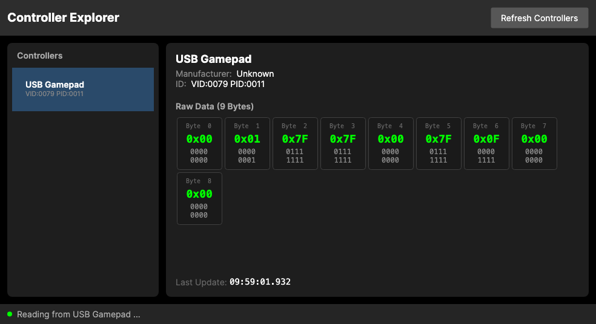
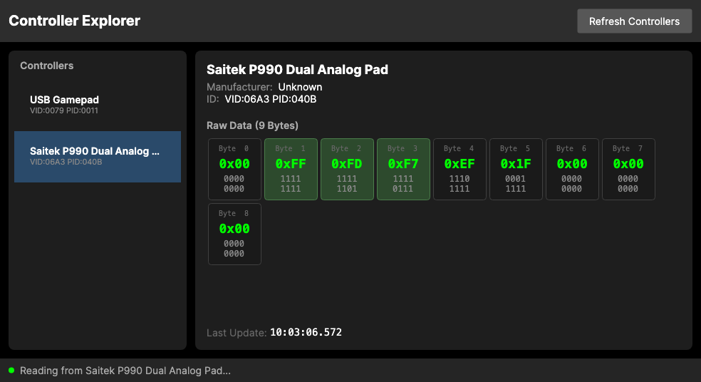

# Controller Explorer

A cross-platform .NET 9 application built with Avalonia UI for reading and displaying real-time data from USB and Bluetooth game controllers. This tool assists in creating games that read from these controllers by providing visibility into the raw input data.

## Features

- **Multi-controller support** - Detects and lists all connected USB/Bluetooth game controllers
- **XInput support (Windows)** - Native support for Xbox-compatible controllers including ROG Ally, Xbox controllers, and other XInput devices
- **Real-time data display** - Shows controller data updating continuously with variable byte counts based on device type
- **Hex + Binary visualization** - Each byte displayed as hex (e.g., `0x3F`) with full 8-bit binary breakdown
- **Change highlighting** - Visual indicator when byte values change
- **Cross-platform** - Runs on Windows, macOS, and Linux
- **Screenshot export** - Save the current view as a PNG image

## Keyboard Shortcuts

| Shortcut | Action |
|----------|--------|
| `Ctrl+S` | Save screenshot as PNG |

## Screenshots








The application displays:
- Left panel: List of detected controllers with VID:PID identifiers (HID) or XInput index (Xbox controllers)
- Right panel: Controller metadata and data grid with hex/binary values
- Status bar: Connection status and last update timestamp

## Byte Data Documentation

### XInput Controllers (Windows)

Xbox-compatible controllers on Windows use XInput and report 12 bytes of data:

| Bytes | Description | Values |
|-------|-------------|--------|
| 0-1 | Buttons | 16-bit flags (see button table below) |
| 2 | Left Trigger | 0-255 |
| 3 | Right Trigger | 0-255 |
| 4-5 | Left Stick X | -32768 to 32767 (little-endian) |
| 6-7 | Left Stick Y | -32768 to 32767 (little-endian) |
| 8-9 | Right Stick X | -32768 to 32767 (little-endian) |
| 10-11 | Right Stick Y | -32768 to 32767 (little-endian) |

#### XInput Button Flags (Bytes 0-1)

| Bit | Button |
|-----|--------|
| 0 | D-Pad Up |
| 1 | D-Pad Down |
| 2 | D-Pad Left |
| 3 | D-Pad Right |
| 4 | Start |
| 5 | Back |
| 6 | Left Stick Press |
| 7 | Right Stick Press |
| 8 | Left Bumper |
| 9 | Right Bumper |
| 12 | A |
| 13 | B |
| 14 | X |
| 15 | Y |

### HID Controllers (All Platforms)

HID controllers report variable-length data depending on the device. The byte layout is device-specific and varies by manufacturer. Common patterns include:

- **Byte 0**: Often a report ID
- **Buttons**: Usually packed as bit flags across 1-3 bytes
- **Analog sticks**: Typically 1 byte per axis (0-255, centered at 128)
- **Triggers**: Usually 1 byte each (0-255)
- **D-Pad**: Often encoded as a 4-bit value (0-7 for directions, 8 or 15 for neutral)

Use the binary visualization to observe which bits change when pressing buttons, and watch the hex values when moving analog inputs to decode your specific controller's data format.

## Requirements

- [.NET 9 SDK](https://dotnet.microsoft.com/download/dotnet/9.0)
- A USB or Bluetooth game controller
- On Linux, a udev rule granting access to the controller — see
  [Platform Notes > Linux](#linux)

## Building

```bash
# Clone the repository
git clone https://github.com/yourusername/ControllerExplorer.git
cd ControllerExplorer

# Build
dotnet build

# Run
dotnet run
```

## Usage

1. Connect a USB or Bluetooth game controller to your computer
2. Launch the application
3. Click **Refresh Controllers** to scan for connected devices
4. Select a controller from the list
5. Interact with the controller (press buttons, move sticks, triggers)
6. Observe the byte values updating in real-time

## Platform Notes

### Windows

**XInput Controllers**: Xbox-compatible controllers (Xbox 360, Xbox One, Xbox Series, ROG Ally, etc.) are automatically detected via XInput and appear with "XInput" in their identifier. These controllers are polled at ~60Hz.

**HID Controllers**: Non-Xbox controllers (PlayStation, Nintendo, third-party) are read via HID and appear with their VID:PID.

### macOS

You may need to grant accessibility permissions for the application to read HID devices. Go to **System Preferences > Security & Privacy > Privacy > Input Monitoring** and add the application.

Note: Xbox controllers on macOS are read via HID (not XInput) and will have a different byte layout than on Windows.

### Linux

On Linux, HID devices are exposed as `/dev/hidraw*`, and by default these are
owned by root with mode `0600`:

```
crw------- 1 root root 243, 13 /dev/hidraw13
```

Nothing grants a normal user access to them, so `HidDevice.Open()` fails with a
permission error and the app reports that it cannot open the HID class device.
This is the one setup step Linux needs — the app itself requires no changes.

Two things that commonly mislead here:

- **Being in the `input` group does not help.** That group governs
  `/dev/input/*`, not `/dev/hidraw*`.
- **systemd's built-in `uaccess` rules do not cover gamepads.** They grant
  hidraw access to 3D mice, hardware wallets and DJ controllers only, so a game
  controller gets nothing.

#### 1. Find your controller's vendor and product ID

```bash
# List every HID device with its VID:PID
for d in /sys/class/hidraw/hidraw*; do
  echo "$(basename $d): $(grep HID_NAME $d/device/uevent | cut -d= -f2)"
  grep HID_ID $d/device/uevent
done

# Or, if you know the device node
udevadm info -q property -n /dev/hidraw13 | grep -E "ID_VENDOR_ID|ID_MODEL_ID|ID_MODEL="
```

`HID_ID` is formatted `bus:VVVVVVVV:PPPPPPPP`; the last four hex digits of each
of the final two fields are the vendor and product ID. For example
`0003:00000079:00000011` means vendor `0079`, product `0011`.

#### 2. Add a udev rule

```bash
sudo nano /etc/udev/rules.d/70-controller-explorer.rules
```

```udev
# Grant the logged-in user access to this controller.
SUBSYSTEM=="hidraw", ATTRS{idVendor}=="0079", ATTRS{idProduct}=="0011", TAG+="uaccess"
```

Add one line per controller you want to inspect.

`TAG+="uaccess"` grants an ACL to whoever is physically logged in, which is
safer than the `MODE="0666"` seen in many guides — that makes the device
readable and writable by *every* account and every process on the machine,
including anything sandboxed or remote.

#### 3. Reload and reconnect

```bash
sudo udevadm control --reload && sudo udevadm trigger
```

Then **unplug and replug the controller**. The ACL is applied when the device
appears, so a device that was already connected keeps its old permissions.

#### 4. Verify

```bash
getfacl /dev/hidraw13
```

You should see a line naming your user:

```
user:yourname:rw-
```

If it is missing, the rule did not match — re-check the VID/PID and confirm you
replugged the device.

#### Granting access to all HID devices

For exploring arbitrary devices, a single rule covers everything:

```udev
SUBSYSTEM=="hidraw", TAG+="uaccess"
```

Convenient, but note what it means: `hidraw` includes your **keyboards**, so any
process running as your user could read raw keystrokes. Prefer per-device rules
unless you specifically need the wide net.

#### Display scaling (HiDPI)

Avalonia uses its X11 backend on Linux, so under a Wayland compositor the app
runs through XWayland — which is never told about fractional scaling. On a HiDPI
screen the UI would render at 1x and look tiny while native apps scale
correctly.

The app now detects the desktop scale at startup and applies it before Avalonia
initializes, so this works with no configuration. It reads, in order:

1. Hyprland's exact per-monitor scale, via `hyprctl -j monitors`
2. `GDK_SCALE` (integer only, so 1.6 would be reported as 2)
3. `Xft.dpi` from `xrdb -query`, where 96 dpi is 1x

To override the detection, set either variable before launching — an explicit
value always wins:

```bash
AVALONIA_GLOBAL_SCALE_FACTOR=1.5 dotnet run

# or per monitor
AVALONIA_SCREEN_SCALE_FACTORS="DP-2=1.6;HDMI-A-1=1" dotnet run
```

Detection uses the focused monitor's scale and applies it globally. On a
multi-monitor setup with *different* scales, set `AVALONIA_SCREEN_SCALE_FACTORS`
explicitly.

#### Note on XInput

XInput is Windows-only. The project already handles this — `Vortice.XInput` is
referenced only on Windows and the XInput service is compiled out via
`#if WINDOWS` — so on Linux the app builds clean and uses the HID path for every
controller, including Xbox pads. Expect a different byte layout than the XInput
tables above.

## Technology Stack

- **.NET 9** - Target framework
- **Avalonia UI 11.x** - Cross-platform UI framework
- **HidSharp** - Cross-platform HID device library
- **Vortice.XInput** - XInput wrapper for Windows
- **CommunityToolkit.Mvvm** - MVVM framework

## Project Structure

```
ControllerExplorer/
├── Models/
│   ├── ControllerDevice.cs    # Device wrapper (HID + XInput)
│   └── ControllerData.cs      # Variable-length data container
├── Services/
│   ├── IControllerService.cs  # Service interface
│   ├── HidControllerService.cs # HID reading implementation
│   ├── XInputControllerService.cs # XInput reading (Windows)
│   └── CompositeControllerService.cs # Combines HID + XInput
├── ViewModels/
│   ├── ByteDisplayViewModel.cs # Individual byte display
│   ├── ControllerViewModel.cs  # Controller with bytes
│   └── MainWindowViewModel.cs  # Main orchestration
├── Views/
│   └── MainWindow.axaml       # Main UI
└── Converters/
    └── BoolToColorConverter.cs # Status indicator
```

## License

This project is licensed under the MIT License - see the [LICENSE](LICENSE) file for details.

## Author

Lonnie Watson
